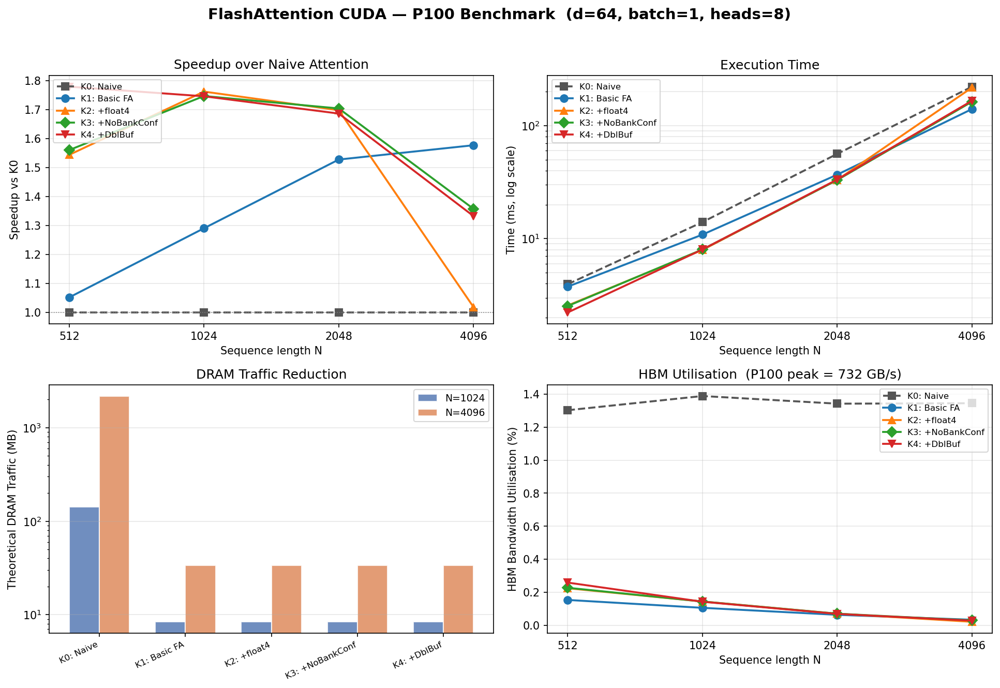

# FlashAttention CUDA — P100 优化实验

从零实现 FlashAttention，在 NVIDIA Tesla P100（Pascal, sm_60）上逐步优化，
展示从 Memory Bound 的 Naive Attention 到 GEMM 风格线程重映射的完整优化路径。
不依赖 PyTorch/cuBLAS，纯 CUDA C。

---

## 性能结果



*Batch=1, Heads=8, d=64, P100 (732 GB/s HBM)。图表可在增加 K5/K6 数据后通过 `python bench/plot_results.py` 重新生成。*

### 数值汇总（K0–K4 实测，K5/K6 待集群运行）

| N | K0 (ms) | K1 | K2 | K3 | K4 |
|---|---------|----|----|----|----|
| 512  | 3.96 | 3.76 (1.05×) | 2.56 (1.54×) | 2.53 (1.56×) | **2.22 (1.78×)** |
| 1024 | 14.02 | 10.86 (1.29×) | 7.95 (1.76×) | 8.02 (1.75×) | **7.98 (1.75×)** |
| 2048 | 56.33 | 36.87 (1.53×) | 33.17 (1.70×) | 33.05 (1.70×) | **33.40 (1.69×)** |
| 4096 | 221.5 | 140.4 (1.58×) | 217.5 (1.02×) | 163.2 (1.36×) | **166.2 (1.33×)** |

DRAM 流量：K0 在 N=4096 产生 **2181 MB**（N² 矩阵），K1–K4 仅 **33.6 MB**（64× 减少）。

---

## 优化路径

| Kernel | 核心改动 | 消除的瓶颈 |
|--------|----------|-----------|
| **K0: Naive Attention** | 显式分配 N×N S 矩阵于 HBM，三趟 kernel | — |
| **K1: Basic FlashAttention** | Tiling + Online Softmax，消除 N×N HBM 写入；Q 加载到寄存器 | O(N²) DRAM 流量 |
| **K2: +Reg + float4** | Q/K/V cooperative load 改用 float4 向量化；寄存器缓存更多中间值 | 部分 global load 开销 |
| **K3: +NoBankConflict + CoopLoad** | 调整 K/V 的 cooperative load 访问模式，减少 shared memory bank conflict | shared memory bank conflict |
| **K4: +DoubleBuffer** | 双缓冲预取下一 KV tile，隐藏加载延迟 | 部分 load/compute 串行 |
| **K5: +TwoPhaseSoftmax** | 将 online softmax 拆成两阶段：Phase 1 只算 max（无 exp），Phase 2 独立 exp + 累加；exp 次数 64→34/tile，消除 per-step exp 串行链 | exp 串行依赖链 |
| **K6: +GemmStyle** | 线程重映射：`thread(tx,ty)` 直接计算完整点积 `S[ty][tx]`（64 FMA，零 warp reduction）；softmax 仅需 2 次 reduction/tile（原为 32 次） | **warp reduction 串行链（根本瓶颈）** |

### K1–K5 的根本问题（K6 所修复的）

K1–K5 的内循环架构：1 个 warp（32 线程）计算 1 行 Q 的 1 个点积，每次需要 5 步 `__shfl_down_sync` 归约。一个 tile 含 Bc=32 列 → **32 次串行 warp reduction = 160 次依赖 shuffle，约 800 cycle 纯等待**。

K6 的修复：

```
Before (K1–K5):                      After (K6):
thread(lane, row)                     thread(tx, ty)
  owns 2 elem of Q-row                  owns full S[ty][tx]
  2 FMA + 5 shuffle × 32 times          64 FMA × 1 time, ZERO shuffle
  = 64 FMA + 160 shuffle/tile           = 64 FMA + 0 shuffle/tile
  softmax: 32 reductions/tile           softmax: 2 reductions/tile
```

---

## 文件结构

```
src/
  naive_attention.cu       # K0: 三趟 kernel，N×N S 矩阵写 HBM
  flash_attention_v1.cu    # K1: Tiling + Online Softmax
  flash_attention_v2.cu    # K2: +float4 向量化加载
  flash_attention_v3.cu    # K3: +CoopLoad 消除 bank conflict
  flash_attention_v4.cu    # K4: +双缓冲预取
  flash_attention_v5.cu    # K5: +两阶段 softmax，独立 exp ILP
  flash_attention_v6.cu    # K6: +GEMM 风格线程映射，消除 warp reduction
bench/
  benchmark.cu             # 纯 CUDA C，cudaEvent 计时，输出表格 + results.csv
  plot_results.py          # Python，读取 results.csv 生成 docs/benchmark_results.png
docs/
  benchmark_results.png    # 性能图（make bench && python bench/plot_results.py 生成）
Makefile
```

---

## 编译和运行

```bash
module load cuda/10.2          # 集群加载 CUDA

make bench                     # 编译所有 kernel + benchmark 可执行文件
./build/benchmark              # 运行，结果写入 results.csv

python bench/plot_results.py   # 生成性能图 docs/benchmark_results.png

# 如果 nvcc 不在 PATH：
make bench NVCC=/usr/local/cuda-10.2/bin/nvcc ARCH=sm_60

# 单独编译某个 kernel：
make k0   # naive_attention.so
make k6   # flash_attention_v6.so
```

---

## Online Softmax 原理

标准 softmax 需要两遍扫描（先找 max，再算 exp sum）。
Online Softmax 合并为一遍，维护运行最大值 $m$ 和归一化因子 $l$：

$$
m_{\text{new}} = \max(m_{\text{old}},\ m_{\text{block}})
\qquad
l_{\text{new}} = l_{\text{old}} \cdot e^{m_{\text{old}} - m_{\text{new}}} + \sum_j e^{s_j - m_{\text{new}}}
$$

FlashAttention 利用这个性质在 tile 间递推，无需实例化完整 S 矩阵（DRAM 流量从 O(N²) 降至 O(Nd)）。

---

## 参考

- [FlashAttention 论文](https://arxiv.org/abs/2205.14135) — Dao et al., 2022
- [flash-attention-minimal](https://github.com/tspeterkim/flash-attention-minimal) — K1 实现参考
